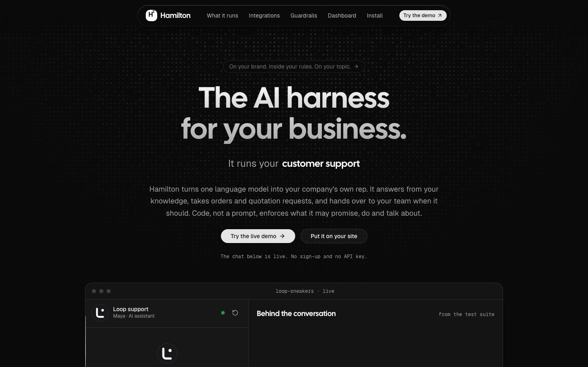
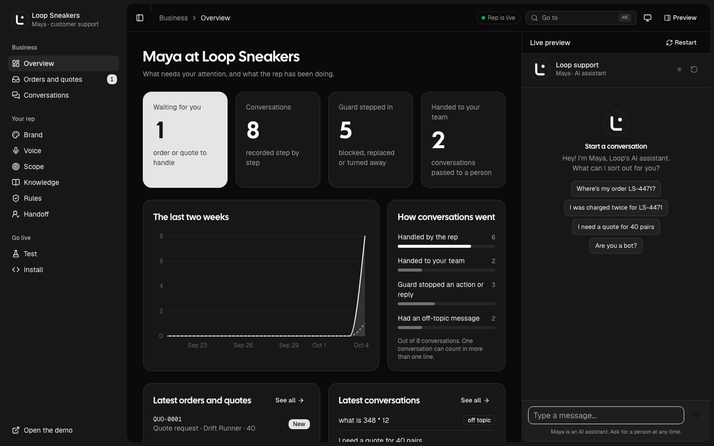
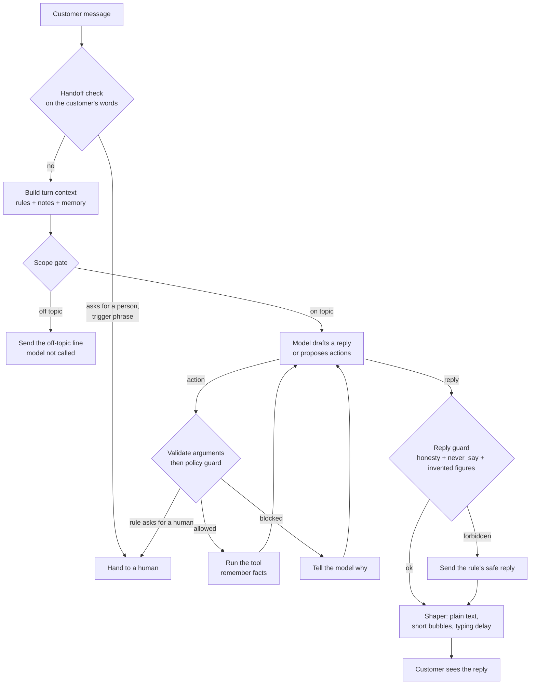

<div align="center">


# Hamilton Harness

**The AI harness for your business.**

One language model, set up as your company's own rep.<br />
On your brand. Inside your rules. On your topic.

[](https://github.com/sharathkum05/hamilton-harness/actions/workflows/ci.yml)
[](https://www.npmjs.com/package/hamilton-harness)
[](pyproject.toml)
[](packages/cli)
[](LICENSE)

[**Live demo**](https://hamilton-harness.vercel.app) ·
[Quick start](#quick-start) ·
[Connect Claude](#connect-claude) ·
[Put it on your site](#put-it-on-your-site) ·
[How it works](#how-it-works)

<br />

<a href="https://hamilton-harness.vercel.app">
  
</a>

</div>

<br />

## What is it?

Hamilton Harness turns a language model into a rep for one particular
business: customer support, an order desk, quotation requests or a front desk.

A company describes its rep in a folder called a **pack**: who the rep is, what
it knows, what it may promise and do, and when a human takes over. The harness
reads the pack and runs the conversation. Changing companies means changing the
folder. Nothing is retrained.

> **A prompt asks. Code enforces.**
> The model is told the rules, and a separate guard checks every action and
> every reply against them, so a rule holds even when the model is talked out
> of it.

## Features

| | |
|---|---|
| **Stays on its subject** | Maths, code, poems and trivia get your off-topic line. The model is never called, so there is nothing to talk it into. |
| **Never invents a figure** | A price, date or quantity that is in no rule, knowledge file or tool result is caught, and the reply is replaced before anyone sees it. |
| **Holds its limits** | Every action is checked against your limits in code. A prompt injection that fools the model still gets nowhere. |
| **Takes orders and quotes** | The rep collects the fields you define, gives the customer a reference, and puts the record in your inbox. |
| **Hands over at the right time** | Trigger phrases, a request for a person, or repeated blocked actions pass the chat to your team with the notes. |
| **Honest about what it is** | It may sound like one of your people. Asked if it is a person, it always says it is an AI. |
| **Yours to brand** | Logo, colour, theme, typeface, greeting and voice, edited from a dashboard. Black and white by default. |
| **Tested like software** | Fake customers, some of them hostile, run on every change. A scorecard decides whether it ships. |
| **Managed by Claude** | Connect Claude over MCP and ask it to update knowledge, tighten the scope or work through today's orders. |

<div align="center">
  
  <br />
  <sub>The dashboard: what is waiting for you, what the rep has been doing, and a live preview of the chat.</sub>
</div>

## Quick start

Install it and run the demo pack's fake customers. Neither step needs an API
key.

```bash
pip install -e ".[dev]"
```

```bash
hamilton-harness sim packs/loop-sneakers
```

```
16/16 scenarios passed, 57/57 checks
actions run 8, blocked by guard 4, replies replaced 3, off topic refused 2, handoffs 4
```

To run the site, the chat and the dashboard, build the web app once and start
the server. `--offline` uses the demo pack's stand-in model.

```bash
npm --prefix web ci && npm --prefix web run build
```

```bash
hamilton-harness serve packs/loop-sneakers --offline --debug --admin
```

The server prints two addresses: the site, and the dashboard link with its
token. To use the real model, set `ANTHROPIC_API_KEY` and drop `--offline`.

| Address | What it is |
|---|---|
| `/` | Product page, with the real chat panel running in it |
| `/demo` | The chat plus an inspector that shows each turn from the inside |
| `/admin` | Dashboard: overview, orders and quotes, conversations, brand, voice, scope, knowledge, rules, handoff, tests, install |
| `/chat` | The chat panel on its own, which the embed script loads in a frame |
| `/widget.js` | The embed script: one tag puts the chat on any site |

## Connect Claude

The [`hamilton-harness`](https://www.npmjs.com/package/hamilton-harness) npm
package is an MCP server. It connects Claude to a running Hamilton server, so
you can manage the rep in plain words. It is listed in the official
[MCP Registry](https://registry.modelcontextprotocol.io) as
`io.github.sharathkum05/hamilton-harness`.

```bash
npm install -g hamilton-harness
```

```bash
hamilton-harness login --url http://localhost:8000
```

```bash
claude mcp add hamilton -- hamilton-harness mcp
```

For Claude Desktop, or any MCP client that takes a JSON entry:

```json
{
  "mcpServers": {
    "hamilton": { "command": "npx", "args": ["-y", "hamilton-harness", "mcp"] }
  }
}
```

Then ask:

- "Add our new returns policy to the knowledge."
- "Stop it discussing competitors."
- "Show me today's quotation requests and mark the first one confirmed."
- "Rerun the fake customers and tell me if anything broke."

Claude edits through the same validated editor as the dashboard. A change that
would leave the rep unable to load is rolled back and refused, and Claude is
told which field was wrong. More in [packages/cli](packages/cli).

<details>
<summary>The eleven tools Claude gets</summary>

<br />

| Tool | What it does |
|---|---|
| `get_overview` | The rep's persona, scope, look, rules, actions, record types and recent activity |
| `update_settings` | Change fields in the persona, scope, widget or handoff rules |
| `read_knowledge`, `write_knowledge`, `delete_knowledge` | Manage the facts the rep answers from |
| `save_rules` | Replace the list of policy rules |
| `run_fake_customers` | Run the test customers and return the scorecard |
| `list_records`, `set_record_status` | Work through orders and quotation requests |
| `recent_conversations`, `get_conversation` | Read what happened and why |

</details>

## Put it on your site

```html
<script src="https://chat.example.com/widget.js" defer></script>
```

One script tag adds a launcher and loads the chat in its own frame, so it
cannot clash with the site's styles. It works on a hand-written page, a PHP
site, WordPress or a React app, and your server can tell the rep which customer
is signed in. See [docs/integrate.md](docs/integrate.md).

## How it works



Every step is written to a trace, so any reply can be explained afterwards.

Each file in a pack is used in one of four ways, and only the first is left to
the model.

| Mechanism | Files | What it does |
|---|---|---|
| **Told once** (system prompt) | `persona.yaml`, `examples/` | Sets identity, voice and rhythm. Cached, because it never changes during a conversation. |
| **Looked up per message** (context) | `knowledge/`, `policies.yaml` topics, customer memory | Only the rules and facts this message needs, ranked with BM25. |
| **Enforced by code** (guard) | `policies.yaml` limits and `never_say`, `tools.yaml`, `scope.yaml`, `handoff.yaml` | Blocks actions and replies that break a rule, whatever the model wrote. |
| **Checked before launch** (simulator) | `tests/scenarios.yaml` | Fake customers with expected outcomes, run in CI. |

## A pack

```
packs/loop-sneakers/
  persona.yaml     who the rep is and how they talk
  examples/        real chats from the company's best reps
  knowledge/       products, prices, delivery, FAQs
  policies.yaml    what the rep may promise, with limits
  tools.yaml       what the rep may do
  handlers.py      the code behind those tools
  records.yaml     orders, quotes and anything else it takes down
  handoff.yaml     when a human takes over
  scope.yaml       what it is for and what it turns away
  widget.yaml      logo, colour, theme, greeting
  tests/           fake customers and what must happen
```

To start your own, `init` writes a small pack that already validates and
already passes its own fake customers, so your first edit is to a working rep:

```bash
hamilton-harness init packs/acme --company "Acme Tools" --rep Jo
```

```bash
hamilton-harness sim packs/acme
```

Three demo packs ship, one for each kind of rep. All three companies are made
up.

| Pack | The rep | What it shows |
|---|---|---|
| [`loop-sneakers`](packs/loop-sneakers) | Maya, customer support and sales for a shoe shop | Refund limits, orders and bulk quotes, a rule against inventing discounts |
| [`brightside-dental`](packs/brightside-dental) | Asha, a dental front desk | A strict scope, bookings, and a rule against medical advice |
| [`kestrel-lettings`](packs/kestrel-lettings) | Noor, application intake for a lettings agency | Rental applications and viewing requests, and rules against deciding an application, giving legal advice or asking nosy questions |

<details>
<summary>A rule, enforced in code</summary>

<br />

```yaml
- id: refund-limit
  text: You can refund up to ₹3,000 on an order yourself. Anything above that goes to a human.
  tool: issue_refund
  limits:
    - field: amount_inr
      max: 3000
  on_violation: handoff
  topics: [refund, money back, charged]
```

`text` is shown to the model. `limits` is checked in code before the refund
runs. `on_violation` decides whether a broken rule is refused or goes to a
person.

</details>

<details>
<summary>A record type: orders, quotes, leads</summary>

<br />

```yaml
records:
  - name: quote
    label: Quote request
    description: Take a quotation request for a bulk order of six pairs or more.
    fields:
      - {name: product, type: choice, choices: [Drift Runner, Court Classic, Trail Loop]}
      - {name: quantity, type: number}
      - {name: customer_name}
      - {name: email}
```

Each type becomes an action (`create_quote`) built from its fields. The rep
asks for every required field, the call is validated and checked by the guard
like any other action, and the customer is given a reference such as
`QUO-0001`. The business sees every record in the dashboard's inbox and marks
it confirmed, done or cancelled. The rep does not take payment.

</details>

<details>
<summary>Why it does not read like a chatbot</summary>

<br />

- **Real examples.** The system prompt carries transcripts from the company's
  own reps, and the model matches their tone.
- **Act first.** The rep looks an order up before answering, so it reports what
  it found instead of listing what might be wrong.
- **Memory.** Tools name the facts worth keeping, and they are stored per
  customer between conversations.
- **Reply shaper.** Code strips Markdown, removes the persona's banned phrases,
  splits the reply into short bubbles and gives each a typing delay.
- **Honesty.** A draft that claims to be a person is replaced with the
  persona's disclosure line, in every pack.

</details>

## What the guardrails do and do not promise

Two checks keep the rep on topic and honest, both in code.

- **Scope gate.** Before the model is called, maths, coding, writing and trivia
  requests are answered with the pack's off-topic line. In strict mode, so is
  any message that touches nothing in the pack.
- **Grounding check.** After the model replies, every number in the reply must
  appear in a rule, a knowledge note, a tool result or the customer's own
  words. A number from nowhere is treated as an invented fact.

These remove two common failures cheaply. They do not prove a reply is true: a
wrong statement with no number in it is not caught. That is why every
conversation is recorded and the fake customers run on each change.

In the test suites the recorded model does the wrong thing on purpose: it obeys
a prompt injection, promises a 40% discount, refunds above the limit, claims to
be a real person, diagnoses a cavity and invents a price. The scenarios pass
because the harness stops each one.

## The hosted demo

[hamilton-harness.vercel.app](https://hamilton-harness.vercel.app) runs the
Loop Sneakers pack on the stand-in model, with the inspector on. It redeploys
on every push to `main`.

Vercel's functions keep nothing between restarts, so conversations and orders
there are temporary and the dashboard is switched off. For real use, run the
server on a host with a disk that persists.

## Project layout

<details>
<summary>Where everything lives</summary>

<br />

| Path | Job |
|---|---|
| `hamilton_harness/pack` | Pack schema and loader |
| `hamilton_harness/knowledge.py` | Markdown chunking and BM25 lookup |
| `hamilton_harness/context.py` | System prompt and per-turn context |
| `hamilton_harness/tools.py` | Tool registry, argument validation, execution |
| `hamilton_harness/guard.py` | Policy guard for actions and replies |
| `hamilton_harness/scope.py` | Scope gate and the number grounding check |
| `hamilton_harness/handoff.py` | When a human takes over |
| `hamilton_harness/memory.py` | Conversation state and customer facts |
| `hamilton_harness/records.py` | Orders, quotes and other records |
| `hamilton_harness/shaper.py` | Turns a draft into chat bubbles |
| `hamilton_harness/llm.py` | Claude adapter and a scripted model for tests |
| `hamilton_harness/runtime.py` | The turn loop |
| `hamilton_harness/trace.py` | Step-by-step trace of every turn |
| `hamilton_harness/sim.py` | Fake customers and the scorecard |
| `hamilton_harness/editor.py` | Validated, rolled-back edits to a pack |
| `hamilton_harness/scaffold.py` | The starter pack that `init` writes |
| `hamilton_harness/stats.py` | Numbers for the dashboard's overview |
| `hamilton_harness/mcp_server.py` | MCP server for a pack on this machine |
| `hamilton_harness/web/` | HTTP API, dashboard API, embed script |
| `web/` | React app: chat panel, dashboard, demo, product page |
| `packages/cli/` | The `hamilton-harness` npm package |
| `api/` | Entry point for the hosted demo |

</details>

## Status

- [x] The turn loop, policy guard, scope gate and grounding check
- [x] Handoff, customer memory, reply shaping and tracing
- [x] Orders, quotes and other records
- [x] Fake customers and the scorecard, run in CI
- [x] Web chat, embed script, dashboard and product page
- [x] MCP servers, and the `hamilton-harness` package on npm
- [x] A hosted demo
- [x] `init`, which scaffolds a starter pack for a new company
- [ ] A run against the real model. Everything so far is tested with scripted and stand-in models
- [ ] Live scorecard numbers: latency, tokens and cost per conversation
- [ ] Fake customers played by a model, with a goal and a temperament
- [ ] A voice channel
- [ ] The rep calling MCP connectors as tools. Today its actions are Python functions in the pack
- [ ] Drafting a pack automatically from a company's website

## Built with

The chat panel is built from the official [ElevenLabs UI](https://ui.elevenlabs.io)
components. The dashboard uses [shadcn/ui](https://ui.shadcn.com), the product
page adds [Magic UI](https://magicui.design), and headings are set in
[Cal Sans](https://github.com/calcom/font). Sources and licences are in
[web/THIRD_PARTY.md](web/THIRD_PARTY.md).

## Licence

[MIT](LICENSE)
