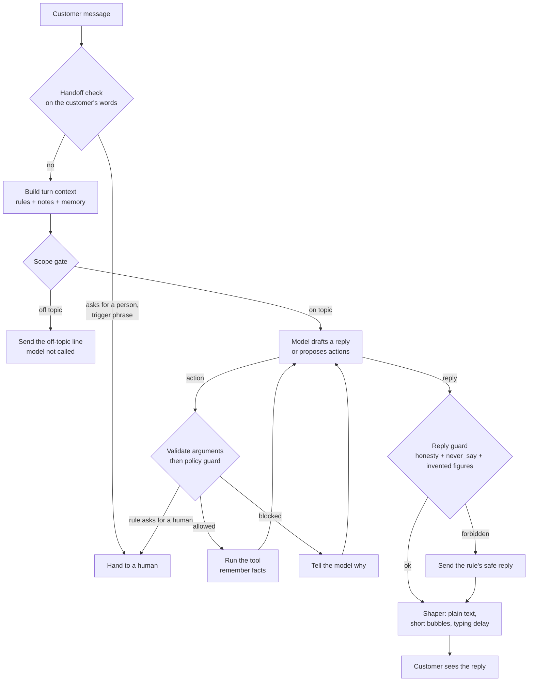

# Hamilton Harness

[](https://github.com/sharathkum05/hamilton-harness/actions/workflows/ci.yml)
[](https://www.npmjs.com/package/hamilton-harness)

**The AI harness for your business.** It turns one language model into your
company's own rep: customer support, an order desk, quotation requests or a
front desk. On your brand, inside your rules, on your topic.

**Live demo: https://hamilton-harness.vercel.app**

A company describes its rep in a folder called a **pack**: who the rep is, what
it knows, what it may promise and do, and when a human takes over. The harness
reads the pack and runs the conversation. Changing companies means changing the
folder. Nothing is retrained.

The design rests on one idea: **a prompt asks, code enforces.** The model is
told the rules, and a separate guard checks every action and every reply
against them, so a rule holds even when the model is talked out of it.

## What it does

- **Stays on its subject.** Maths, code, poems and trivia get the pack's
  off-topic line, and the model is never called.
- **Never invents a figure.** A price, date or quantity that is in no rule,
  knowledge file or tool result is caught and the reply is replaced.
- **Holds its limits.** Every action is checked against the pack's limits in
  code. A prompt injection that fools the model still gets nowhere.
- **Takes orders and quotes.** The rep collects the fields you define, gives
  the customer a reference, and puts the record in your inbox.
- **Hands over at the right time.** Trigger phrases, a request for a person or
  repeated blocked actions pass the chat to your team.
- **Is honest about what it is.** It may sound human. It never says it is one.
- **Is tested like software.** Fake customers, some hostile, run on every
  change, and a scorecard decides whether it ships.

## How one message is handled



Every step is written to a trace, so any reply can be explained afterwards.

## Quick start

Install it and run the demo pack's fake customers. Neither step needs an API
key.

```bash
pip install -e ".[dev]"
```

```bash
hamilton-harness sim packs/loop-sneakers
```

To run the site, the chat and the dashboard, build the web app once and start
the server. `--offline` uses the demo pack's stand-in model.

```bash
npm --prefix web ci && npm --prefix web run build
```

```bash
hamilton-harness serve packs/loop-sneakers --offline --debug --admin
```

The server prints two addresses: the site, and the dashboard link with its
token. To use the real model, set `ANTHROPIC_API_KEY` and drop `--offline`.
`hamilton-harness chat packs/loop-sneakers --debug` does the same in the
terminal.

| Address | What it is |
|---|---|
| `/` | Product page, with the real chat panel running in it |
| `/demo` | The chat plus an inspector that shows each turn from the inside |
| `/admin` | Dashboard: overview, orders and quotes, conversations, brand, voice, scope, knowledge, rules, handoff, tests, install snippets |
| `/chat` | The chat panel on its own, which the embed script loads in a frame |
| `/widget.js` | The embed script: one tag puts the chat on any site |

## Connect Claude

The [`hamilton-harness`](https://www.npmjs.com/package/hamilton-harness) npm
package connects Claude to a running server. Sign in once with the server's
admin token:

```bash
npx hamilton-harness login --url http://localhost:8000
```

Then add it to Claude Code:

```bash
claude mcp add hamilton -- npx -y hamilton-harness mcp
```

Or to Claude Desktop, in its MCP settings:

```json
{
  "mcpServers": {
    "hamilton": { "command": "npx", "args": ["-y", "hamilton-harness", "mcp"] }
  }
}
```

Now ask in plain words: "add our new returns policy to the knowledge", "stop it
discussing competitors", "show me today's quotation requests and mark the first
one confirmed", "rerun the fake customers".

Claude edits through the same validated editor as the dashboard. A change that
would leave the rep unable to load is rolled back and refused, and Claude is
told which field was wrong. The package's own notes are in
[packages/cli](packages/cli).

For a pack on the same machine, with no server running, the Python command has
an MCP server too: `hamilton-harness mcp packs/your-company`.

## Put it on a website

```html
<script src="https://chat.example.com/widget.js" defer></script>
```

One script tag adds a launcher and loads the chat in its own frame, so it
cannot clash with the site's styles. It works on a hand-written page, a PHP
site, WordPress or a React app, and a site can tell the rep which customer is
signed in. See [docs/integrate.md](docs/integrate.md).

## Orders, quotes and other records

A pack can list things the rep takes down for the business in `records.yaml`:

```yaml
records:
  - name: quote
    label: Quote request
    description: Take a quotation request for a bulk order of six pairs or more.
    fields:
      - {name: product, type: choice, choices: [Drift Runner, Court Classic, Trail Loop]}
      - {name: quantity, type: number}
      - {name: customer_name}
      - {name: email}
```

Each type becomes an action (`create_quote`) built from its fields. The rep
asks for every required field, the call is validated and checked by the guard
like any other action, and the customer is given a reference such as
`QUO-0001`. The business sees every record in the dashboard's inbox and marks
it confirmed, done or cancelled. The rep does not take payment.

## Keeping it on topic and honest

Two checks exist for this, both in code.

- **Scope gate.** Before the model is called, maths, coding, writing and trivia
  requests are answered with the pack's off-topic line. In strict mode, so is
  any message that touches nothing in the pack. Sums about the company's own
  prices are allowed.
- **Grounding check.** After the model replies, every number in the reply must
  appear in a rule, a knowledge note, a tool result or the customer's own
  words. A number from nowhere is treated as an invented fact and the reply is
  replaced.

These remove two common failures cheaply. They do not prove a reply is true: a
wrong statement with no number in it is not caught by the grounding check.

## What a pack contains

```
packs/loop-sneakers/
  persona.yaml     who the rep is and how they talk
  examples/        real chats from the company's best reps
  knowledge/       products, prices, delivery, FAQs
  policies.yaml    what the rep may promise, with limits
  tools.yaml       what the rep may do
  handlers.py      the code behind those tools
  records.yaml     orders, quotes and anything else it takes down
  handoff.yaml     when a human takes over
  scope.yaml       what it is for and what it turns away
  widget.yaml      logo, colour, theme, greeting
  tests/           fake customers and what must happen
```

Two demo packs ship: Loop Sneakers (customer support, orders and quotes for a
shoe shop) and Brightside Dental (a front desk with a strict scope and a
no-medical-advice rule).

Each file is used in one of four ways.

| Mechanism | Files | What it does |
|---|---|---|
| Told once (system prompt) | `persona.yaml`, `examples/` | Sets identity, voice and rhythm. Cached, because it never changes during a conversation. |
| Looked up per message (context) | `knowledge/`, `policies.yaml` topics, customer memory | Only the rules and facts this message needs, ranked with BM25. |
| Enforced by code (guard) | `policies.yaml` limits and `never_say`, `tools.yaml`, `scope.yaml`, `handoff.yaml` | Blocks actions and replies that break a rule, whatever the model wrote. |
| Checked before launch (simulator) | `tests/scenarios.yaml` | Fake customers with expected outcomes, run in CI. |

A rule looks like this:

```yaml
- id: refund-limit
  text: You can refund up to ₹3,000 on an order yourself. Anything above that goes to a human.
  tool: issue_refund
  limits:
    - field: amount_inr
      max: 3000
  on_violation: handoff
  topics: [refund, money back, charged]
```

`text` is shown to the model. `limits` is checked in code before the refund
runs. `on_violation` decides whether a broken rule is refused or goes to a
person.

## Why it does not read like a chatbot

- **Real examples.** The system prompt carries transcripts from the company's
  own reps, and the model matches their tone.
- **Act first.** The rep is told to look an order up before answering, so it
  reports what it found instead of listing what might be wrong.
- **Memory.** Tools name the facts worth keeping (`remember:` in `tools.yaml`),
  and they are stored per customer between conversations.
- **Reply shaper.** Code strips Markdown, removes the persona's banned phrases,
  splits the reply into short bubbles and gives each a typing delay.
- **Honesty.** A draft that claims to be a person is replaced with the
  persona's disclosure line, in every pack.

## The scorecard

Output of `hamilton-harness sim packs/loop-sneakers` in replay mode:

```
16/16 scenarios passed, 57/57 checks
actions run 8, blocked by guard 4, replies replaced 3, off topic refused 2, handoffs 4
```

And for `packs/brightside-dental`:

```
10/10 scenarios passed, 30/30 checks
actions run 2, blocked by guard 1, replies replaced 2, off topic refused 3, handoffs 1
```

In several of these the recorded model does the wrong thing on purpose: it
obeys a prompt injection, promises a 40% discount, refunds above the limit,
claims to be a real person, diagnoses a cavity and invents a price. The
scenarios pass because the harness stops each one.

Replay mode proves the harness. It does not measure the model.
`hamilton-harness sim PACK --live` runs the same customers against the real
model and adds latency, token and cost figures; those numbers are not published
here yet.

## The hosted demo

https://hamilton-harness.vercel.app runs the Loop Sneakers pack on the stand-in
model, with the inspector on. It redeploys on every push to `main`.

Vercel's functions keep nothing between restarts, so conversations and orders
there are temporary and the dashboard is switched off. For real use, run the
server on a host with a disk that persists.

## Layout

| Path | Job |
|---|---|
| `hamilton_harness/pack` | Pack schema and loader |
| `hamilton_harness/knowledge.py` | Markdown chunking and BM25 lookup |
| `hamilton_harness/context.py` | System prompt and per-turn context |
| `hamilton_harness/tools.py` | Tool registry, argument validation, execution |
| `hamilton_harness/guard.py` | Policy guard for actions and replies |
| `hamilton_harness/scope.py` | Scope gate and the number grounding check |
| `hamilton_harness/handoff.py` | When a human takes over |
| `hamilton_harness/memory.py` | Conversation state and customer facts |
| `hamilton_harness/records.py` | Orders, quotes and other records the rep takes down |
| `hamilton_harness/shaper.py` | Turns a draft into chat bubbles |
| `hamilton_harness/llm.py` | Claude adapter and a scripted model for tests |
| `hamilton_harness/runtime.py` | The turn loop |
| `hamilton_harness/trace.py` | Step-by-step trace of every turn |
| `hamilton_harness/sim.py` | Fake customers and the scorecard |
| `hamilton_harness/editor.py` | Validated, rolled-back edits to a pack |
| `hamilton_harness/stats.py` | Numbers for the dashboard's overview |
| `hamilton_harness/mcp_server.py` | MCP server for a pack on this machine |
| `hamilton_harness/web/` | HTTP API, dashboard API, embed script |
| `web/` | React app: chat panel, dashboard, demo, product page |
| `packages/cli/` | The `hamilton-harness` npm package: sign-in and an MCP server for a remote server |
| `api/` | Entry point for the hosted demo |

The chat panel is built from the official [ElevenLabs UI](https://ui.elevenlabs.io)
components. The dashboard uses shadcn/ui and the product page adds Magic UI.
Sources and licences are in `web/THIRD_PARTY.md`.

## Status

Working and tested: the turn loop, the guard, scope and grounding, handoff,
memory, shaping, tracing, records, the simulator in replay mode, the web chat,
the dashboard, both MCP servers, the hosted demo and CI.

Not done yet:

- A run against the real model. Everything so far is tested with scripted and
  stand-in models.
- Live scorecard numbers (latency, tokens, cost per conversation).
- Fake customers played by a model, with a goal and a temperament.
- A voice channel.
- The rep calling MCP connectors as tools. Today its actions are Python
  functions in the pack.
- Drafting a pack automatically from a company's website.

Loop Sneakers and Brightside Dental are made-up companies.

## Licence

MIT
