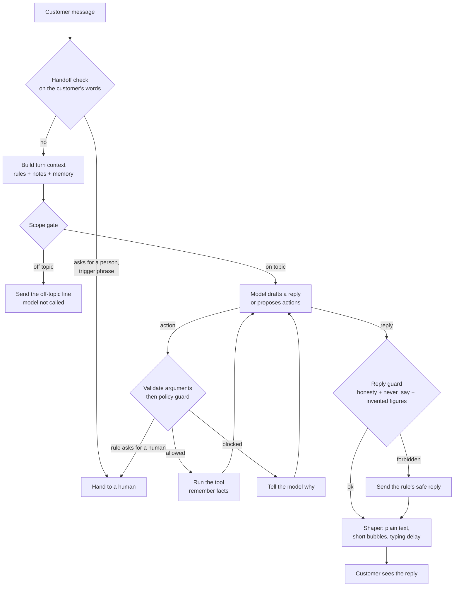

# repkit

[](https://github.com/sharathkum05/repkit/actions/workflows/ci.yml)

**The AI harness for your business.** It turns one LLM into your company's own
rep: customer support, an order desk, quotation requests or a front desk.

A company describes its rep in a folder called a **pack**: who the rep is, what
it knows, what it may promise and do, and when a human takes over. The harness
reads the pack and runs the conversation. Changing companies means changing the
folder. Nothing is retrained.

The design rests on one idea: **a prompt asks, code enforces.** The model is
told the rules, and a separate guard checks every action and every reply
against them, so a rule holds even when the model is talked out of it.

## How one message is handled



Every step is written to a trace, so any reply can be explained afterwards.

## Quick start

```bash
pip install -e ".[dev]"
```

```bash
repkit validate packs/loop-sneakers
```

```bash
repkit sim packs/loop-sneakers
```

`sim` runs the pack's fake customers in replay mode, which needs no API key.

To see the web chat, the dashboard and the product page, build the web app
once and start the server. `--offline` uses the demo pack's stand-in model, so
this also needs no API key.

```bash
npm --prefix web ci && npm --prefix web run build
```

```bash
repkit serve packs/loop-sneakers --offline --debug --admin
```

The server prints two addresses: the site, and the dashboard link with its
token. To use the real model instead, set `ANTHROPIC_API_KEY` and drop
`--offline`. `repkit chat packs/loop-sneakers --debug` does the same in the
terminal.

## What is in the box

| Address | What it is |
|---|---|
| `/` | Product page, with the real chat panel running in the hero |
| `/demo` | The chat plus an inspector that shows each turn from the inside |
| `/admin` | Dashboard: an inbox of orders and quotes, conversations, brand, voice, scope, knowledge, rules, handoff, tests, install snippets |
| `/chat` | The chat panel on its own, which the embed script loads in an iframe |
| `/widget.js` | The embed script: one tag puts the chat on any site |

The chat panel is built from the official [ElevenLabs UI](https://ui.elevenlabs.io)
components on the layout of their "Voice chat 1" block. The dashboard is on the
shadcn/ui sidebar and the product page adds Magic UI. The theme is black and
white by default; a pack can set its own brand colour. See `web/THIRD_PARTY.md`.

## Orders, quotes and other records

A pack can list things the rep takes down for the business in `records.yaml`:

```yaml
records:
  - name: quote
    label: Quote request
    description: Take a quotation request for a bulk order of six pairs or more.
    fields:
      - {name: product, type: choice, choices: [Drift Runner, Court Classic, Trail Loop]}
      - {name: quantity, type: number}
      - {name: customer_name}
      - {name: email}
```

Each type becomes an action (`create_quote`) built from its fields. The rep
asks for every required field, the call is validated and checked by the guard
like any other action, and the customer is given a reference such as
`QUO-0001`. The business sees every record in the dashboard's inbox and marks
it confirmed, done or cancelled. The rep does not take payment.

Putting the chat on a site (plain HTML, PHP, WordPress, React) and telling the
rep who is signed in are covered in [docs/integrate.md](docs/integrate.md).

## Keeping it on topic and honest

Two checks exist for this, both in code.

- **Scope gate.** Before the model is called, maths, coding, writing and trivia
  requests are answered with the pack's off-topic line. In strict mode, so is
  any message that touches nothing in the pack. Sums about the company's own
  prices are allowed.
- **Grounding check.** After the model replies, every number in the reply must
  appear in a rule, a knowledge note, a tool result or the customer's own
  words. A number from nowhere is treated as an invented fact and the reply is
  replaced.

These remove two common failures cheaply. They do not prove a reply is true: a
wrong statement with no number in it is not caught by the grounding check.

## Let Claude manage the pack

`repkit mcp PACK` is an MCP server. Connect Claude to it and ask in plain words
to add knowledge, tighten the scope, change a rule or rerun the tests.

```json
{
  "mcpServers": {
    "repkit": { "command": "repkit", "args": ["mcp", "packs/your-company"] }
  }
}
```

Claude edits through the same validated editor as the dashboard. An edit that
would leave the pack unloadable is rolled back and refused with the reason.

## What a pack contains

```
packs/loop-sneakers/
  persona.yaml     who the rep is and how they talk
  examples/        real chats from the company's best reps
  knowledge/       products, prices, delivery, FAQs
  policies.yaml    what the rep may promise, with limits
  tools.yaml       what the rep may do
  handlers.py      the code behind those tools
  handoff.yaml     when a human takes over
  scope.yaml       what it is for and what it turns away
  widget.yaml      logo, colour, theme, greeting
  tests/           fake customers and what must happen
```

Two demo packs ship: Loop Sneakers (customer support for a shoe shop) and
Brightside Dental (a front desk with a strict scope and a no-medical-advice
rule).

Each file is used in one of four ways.

| Mechanism | Files | What it does |
|---|---|---|
| Told once (system prompt) | `persona.yaml`, `examples/` | Sets identity, voice and rhythm. Cached, because it never changes during a conversation. |
| Looked up per message (context) | `knowledge/`, `policies.yaml` topics, customer memory | Only the rules and facts this message needs, ranked with BM25. |
| Enforced by code (guard) | `policies.yaml` limits and `never_say`, `tools.yaml`, `handoff.yaml` | Blocks actions and replies that break a rule, whatever the model wrote. |
| Checked before launch (simulator) | `tests/scenarios.yaml` | Fake customers with expected outcomes, run in CI. |

A rule looks like this:

```yaml
- id: refund-limit
  text: You can refund up to ₹3,000 on an order yourself. Anything above that goes to a human.
  tool: issue_refund
  limits:
    - field: amount_inr
      max: 3000
  on_violation: handoff
  topics: [refund, money back, charged]
```

`text` is shown to the model. `limits` is checked in code before the refund
runs. `on_violation` decides whether a broken rule is refused or goes to a
person.

## Why it does not read like a chatbot

- **Real examples.** The system prompt carries transcripts from the company's
  own reps, and the model matches their tone.
- **Act first.** The rep is told to look an order up before answering, so it
  reports what it found instead of listing what might be wrong.
- **Memory.** Tools name the facts worth keeping (`remember:` in `tools.yaml`),
  and they are stored per customer between conversations.
- **Reply shaper.** Code strips Markdown, removes the persona's banned phrases,
  splits the reply into short bubbles and gives each a typing delay.
- **Honesty.** The rep may sound human and may never say it is one. A draft
  that claims to be a person is replaced with the persona's disclosure line, in
  every pack.

## The scorecard

Output of `repkit sim packs/loop-sneakers` in replay mode:

```
16/16 scenarios passed, 57/57 checks
actions run 8, blocked by guard 4, replies replaced 3, off topic refused 2, handoffs 4
```

And for `packs/brightside-dental`:

```
10/10 scenarios passed, 30/30 checks
actions run 2, blocked by guard 1, replies replaced 2, off topic refused 3, handoffs 1
```

In several of these the recorded model does the wrong thing on purpose: it
obeys a prompt injection, promises a 40% discount, refunds above the limit,
claims to be a real person, diagnoses a cavity and invents a price. The
scenarios pass because the harness stops each one.

Replay mode proves the harness. It does not measure the model. `repkit sim
PACK --live` runs the same customers against the real model and adds latency,
token and cost figures; those numbers are not published here yet.

## Layout

| Module | Job |
|---|---|
| `repkit/pack` | Pack schema and loader |
| `repkit/knowledge.py` | Markdown chunking and BM25 lookup |
| `repkit/context.py` | System prompt and per-turn context |
| `repkit/tools.py` | Tool registry, argument validation, execution |
| `repkit/guard.py` | Policy guard for actions and replies |
| `repkit/handoff.py` | When a human takes over |
| `repkit/memory.py` | Conversation state and customer facts |
| `repkit/shaper.py` | Turns a draft into chat bubbles |
| `repkit/llm.py` | Claude adapter and a scripted model for tests |
| `repkit/runtime.py` | The turn loop |
| `repkit/trace.py` | Step-by-step trace of every turn |
| `repkit/sim.py` | Fake customers and the scorecard |
| `repkit/scope.py` | Scope gate and the number grounding check |
| `repkit/records.py` | Orders, quotes and other records the rep takes down |
| `repkit/editor.py` | Validated, rolled-back edits to a pack |
| `repkit/mcp_server.py` | MCP server for managing a pack from Claude |
| `repkit/web/` | HTTP API, dashboard API, embed script, demo page |
| `web/` | React app: chat panel, dashboard, product page |

## Status

Working and tested: the turn loop, the guard, scope and grounding, handoff,
memory, shaping, tracing, records, the simulator in replay mode, the web chat,
the dashboard, the MCP server and CI.

Not done yet:

- A run against the real model. Everything so far is tested with scripted and
  stand-in models.
- Live scorecard numbers (latency, tokens, cost per conversation).
- Fake customers played by a model, with a goal and a temperament.
- A voice channel.
- The rep calling MCP connectors as tools. Today its actions are Python
  functions in the pack.
- Drafting a pack automatically from a company's website.
- A sales pack and an intake pack.

Loop Sneakers and Brightside Dental are made-up companies.

## Licence

MIT
